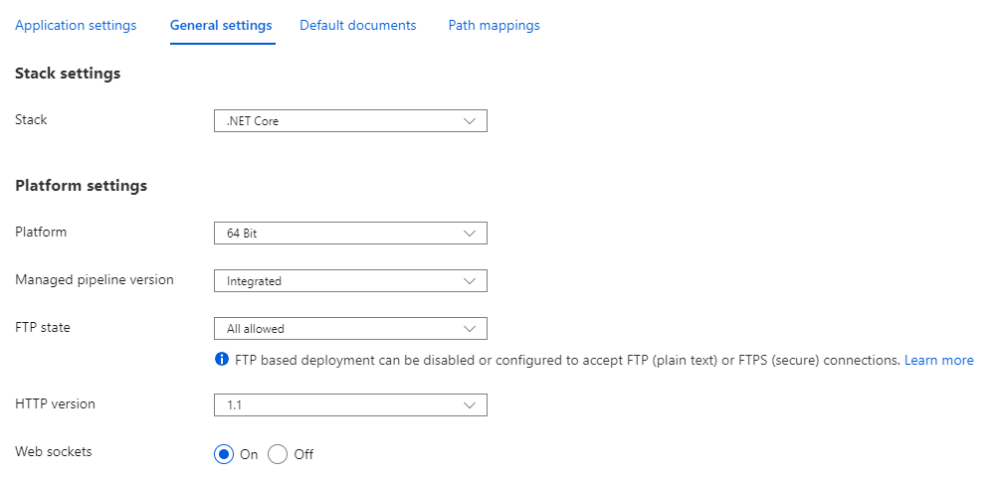

# PowerShell Universal Azure GitHub Actions

GitHub actions for deploying [PowerShell Universal](https://ironmansoftware.com/powershell-universal) to Azure. 

## About 

This repository contains a GitHub action workflow for downloading the latest version of PowerShell Universal, updating the `appsettings.json` and `web.config` to work with Azure and then deploy as an Azure Web App. 

This example uses a Windows Web App. It needs to be setup for .NET Core and with x64 architecture. Ensure that you have web sockets on to allow for Universal Dashboard to function correctly. If you want scheduling to work all the time, ensure you enable Always On. 

